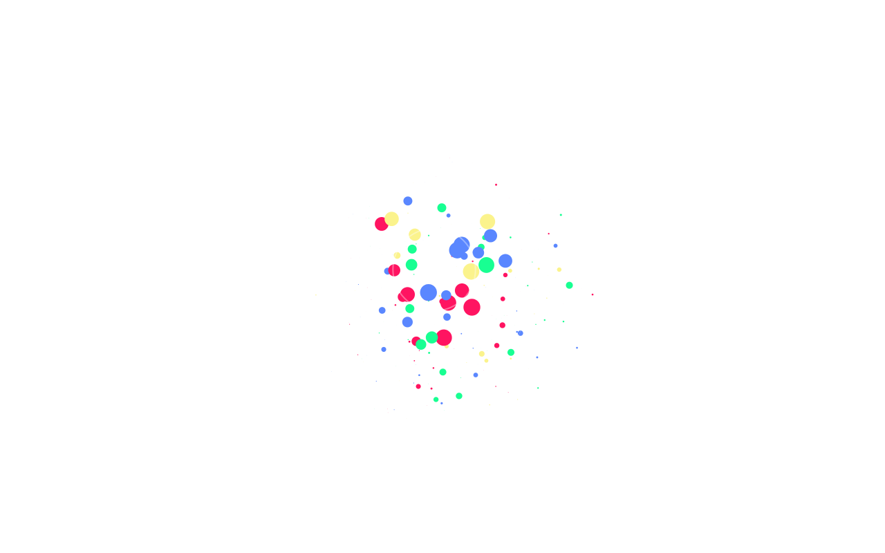

# Anime.js Fireworks

Canvas fireworks demo powered by Anime.js.



**Live demo:** [https://rogue-dev-studio.github.io/animejs-fireworks-canvas-demo/](https://rogue-dev-studio.github.io/animejs-fireworks-canvas-demo/)

## Highlights
- Canvas particles
- Anime.js timing

## Run
Open `index.html` locally (Live Server on port **5500**), or use the live demo above.

```bash
git clone https://github.com/rogue-dev-studio/animejs-fireworks-canvas-demo.git
```

By [Aris Hadisopiyan](https://rogue-dev-studio.github.io/) / Rogue Dev Studio.

MIT
